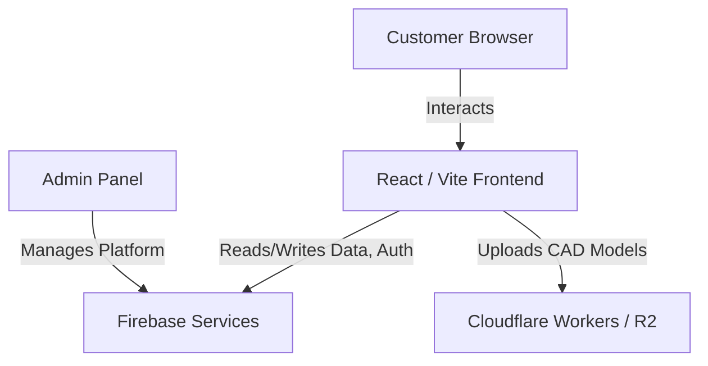
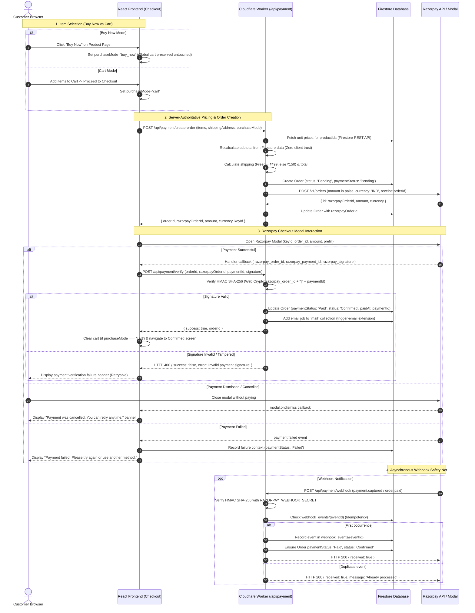
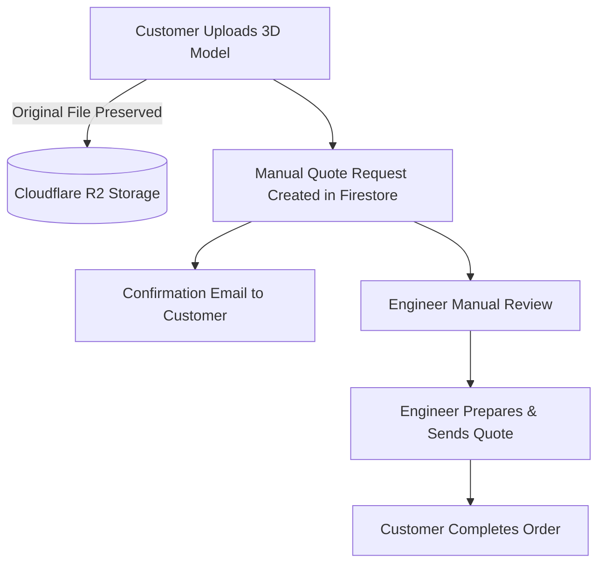
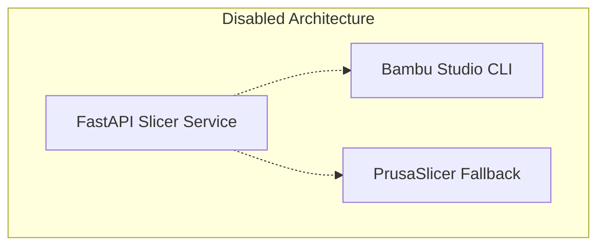

# System Architecture

Shilp Sahayak is built as a modern, serverless e-commerce application utilizing a React frontend paired with Firebase for backend logic and Cloudflare for edge computing and storage.

## 1. High-Level Active Architecture

### Active Services:
- **Frontend**: React, Vite, Tailwind CSS, Zustand, React Query.
- **Firebase**: 
  - Authentication
  - Firestore (Products, Orders, Customers, Reviews, Manual Quotes, Settings)
  - Trigger Email Extension (Notifications)
- **Cloudflare**:
  - R2 File Storage (Original CAD uploads)
  - Cloudflare Workers (Upload orchestration, future secure payment validation)

---

## 2. Shop & Purchase Flow (Razorpay Test Mode)

### Key Architectural Tenets:
- **Zero Client Financial Trust**: Product prices and shipping thresholds are authoritatively fetched and calculated on the Cloudflare Worker. Any client-sent prices or totals are disregarded.
- **Cart vs Buy Now State Isolation**: "Buy Now" transactions check out a single targeted item and clear only `buyNowItem`, preserving existing cart contents. Cart checkouts drain the global cart only upon verified payment.
- **Cryptographic Tamper-Proofing**: Verification uses Web Crypto HMAC SHA-256 against `RAZORPAY_KEY_SECRET` without external heavyweight Node dependencies.
- **Separation of Concerns**: `paymentStatus` tracks financial settlement (`Pending`, `Paid`, `Failed`, `Refunded`), while `orderStatus` tracks physical fulfillment (`Pending`, `Confirmed`, `Processing`, `Ready to ship`, `Shipped`, `Delivered`, `Cancelled`). Payment success automatically advances `orderStatus` to `Confirmed`.

---

## 3. Custom Printing / Shilp Studio Flow (Active)

---

## 4. Archived / Disabled Systems

### Automatic Slicer (`future-tasks/slicer/`)
The previous automated slicer backend (FastAPI, Bambu Studio CLI, PrusaSlicer fallback) is intentionally disabled and archived. It was deemed unsafe for production pricing due to material discrepancies between CLI toolpaths and the reference Bambu Studio Desktop application.

**Rule**: Original customer uploads (STL, OBJ, 3MF, STEP) must remain untouched in storage. The slicer must not overwrite original files, nor should it act as the primary quotation authority until independently validated.

