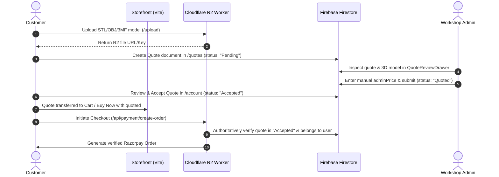

# Shilp Sahayak — Admin Panel & Storefront CMS Master Plan

**Document Version:** 1.0.0  
**Status:** Baseline Specification (Phase 0 Audit Complete)  
**Target Repository:** `https://github.com/RatanabhSharma/Shilpsahayak`  
**Application Scope:** Production 3D Printing & Custom Fabrication Web Application (Patiala, Punjab, India)  

---

## 1. Executive Vision & Core Principles

The objective of this initiative is to upgrade the existing **Shilp Sahayak Admin Panel & Storefront CMS** into an enterprise-ready, robust, and maintainable operational console. This will allow the business owner to manage daily business information, storefront content, branding, navigation, catalog, pricing, promotions, and operations **without modifying React/TypeScript source code or redeploying the frontend**.

### 1.1 The Core Boundary Principle

```
┌────────────────────────────────────────┐   ┌────────────────────────────────────────┐
│      ADMIN PANEL CONTROLS (CMS)        │   │    APPLICATION CODE CONTROLS (LOGIC)   │
├────────────────────────────────────────┤   ├────────────────────────────────────────┤
│ • Business & legal contact info        │   │ • React architecture & routing         │
│ • Storefront content & hero sections   │   │ • Core 3D geometry parsers (STL/3MF)   │
│ • Branding assets & media library      │   │ • Three.js WebGL canvas rendering      │
│ • Product catalog & inventory counts   │   │ • Mathematical pricing algorithms      │
│ • Production & material rates          │   │ • Slicer engine execution & toolpaths  │
│ • Coupons, discounts & campaigns       │   │ • Razorpay cryptographic signatures    │
│ • Shipping rates & delivery thresholds │   │ • Firebase Security Rules              │
│ • Header & footer navigation links     │   │ • Authentication mechanisms            │
│ • Site-wide SEO & OpenGraph tags       │   │ • Server-side payment validation       │
│ • Legal & Policy structured content    │   │ • Cloudflare Worker infrastructure     │
└────────────────────────────────────────┘   └────────────────────────────────────────┘
```

> [!IMPORTANT]
> The Admin Panel is a **structured business CMS and operations console**, NOT a code editor or generic page builder. Arbitrary HTML/JavaScript/CSS injection is strictly prohibited. Every configurable property must be strongly typed and validated.

---

## 2. Baseline Architecture Overview (Phase 0)

### 2.1 Technology Stack
- **Frontend SPA:** React 18, TypeScript 5.5, Vite 5, Tailwind CSS 3.4, Framer Motion 11, Lucide React, Recharts 2.12, Three.js 0.185.
- **Server State:** TanStack React Query 5 (queries and mutations against Firestore).
- **Client/Cart State:** Zustand 4 with `persist` middleware (local cart, buy now item, purchase mode, cached settings).
- **Database & Auth:** Firebase Firestore, Firebase Authentication.
- **Edge Backend:** Cloudflare Worker (`shilp-sahayak-r2/src/index.ts`) bound to Cloudflare R2 storage, Cloudflare KV rate limiting, Google Service Account OAuth token exchange, and Razorpay API.
- **Media Storage:** Cloudflare R2 via worker endpoints (`/upload`, `/file`) with client-side WebP Base64 compression as a zero-infrastructure resilient fallback.

### 2.2 Protected Shilp Studio Custom 3D Printing Workflow
The existing custom 3D printing workflow is a **manual quotation pipeline** that must NOT be converted to automatic instant quoting:



**Non-Negotiable:** This workflow must remain completely untouched during all CMS upgrades.

---

## 3. Firestore Collection Architecture

### 3.1 Existing Collections

| Collection Path | Primary Document Structure | Current Status & Rules |
|---|---|---|
| `/users/{userId}` | `uid`, `email`, `role` (`'admin' \| 'customer'`), `customerType`, `adminNotes`, `address`, `phone`, `createdAt` | Enforced in rules. Admin or self. |
| `/products/{productId}` | `id`, `name`, `slug`, `sku`, `price`, `originalPrice`, `costPrice`, `category`, `image`, `images`, `stock`, `status`, `dimensions`, `weight`, `seoTitle`, `seoDescription`, etc. | Public read; Admin write. 6-tab modal editor. |
| `/products/{id}/reviews/{revId}` | `id`, `productId`, `userId`, `userName`, `rating`, `reviewText`, `verifiedPurchase`, `status` (`'pending' \| 'approved' \| 'rejected'`), `orderId` | Subcollection. Approved public read; author create/edit; Admin moderate. |
| `/categories/{categoryId}` | `id`, `name`, `slug`, `createdAt`, `updatedAt` | Public read; Admin write. Needs schema expansion (image, description, displayOrder, SEO). |
| `/orders/{orderId}` | `id`, `date`, `customerId`, `customerName`, `customerEmail`, `customerPhone`, `address`, `shippingAddress`, `items`, `subtotal`, `shippingFee`, `total`, `status`, `paymentStatus`, `timeline`, `internalNotes` | Owner read; Admin read/write. Direct client creation forbidden (Worker Service Account only). |
| `/quotes/{quoteId}` | `id`, `customerId`, `customerName`, `customerEmail`, `fileName`, `fileUrl`, `fileKey`, `material`, `color`, `quantity`, `status`, `adminPrice`, `orderId`, `reviewedAt` | Owner read; Authenticated create (Pending); Admin price/review; Owner accept. |
| `/settings/{settingId}` | Dedicated configuration documents (see Section 3.3). | Public read for approved document IDs; Admin write. |
| `/inquiries/{inquiryId}` | `id`, `name`, `email`, `phone`, `subject`, `message`, `status`, `createdAt` | Worker creation only; Admin read/update/delete. |
| `/filaments/{filamentId}` | `id`, `name`, `material`, `color`, `costPerGram`, `spoolWeight`, `inStock` | Admin only. |
| `/inventory_logs/{logId}` | `id`, `productId`, `productName`, `sku`, `previousStock`, `newStock`, `delta`, `reason`, `notes`, `adminEmail`, `timestamp` | **Rule Gap:** Currently omitted from `firestore.rules` (must add Admin access). |
| `/webhook_events/{id}` | Razorpay payment idempotency logs. | Admin only. |
| `/mail/{mailId}` | Outbound email queue handled by Cloudflare Worker. | Server-only (`false` for clients). |

### 3.2 Planned Collections to Introduce

| Collection Path | Schema Purpose | Rule Requirement |
|---|---|---|
| `/coupons/{couponId}` | Discount codes, rules, limits, validity, eligibility, usage counts. | Public read/validate (or Worker-only verification); Admin read/write. |
| `/campaigns/{campaignId}` | Promotional banners, sales campaigns, referenced coupons, visibility. | Public read; Admin read/write. |
| `/collections/{collectionId}` | Curated groupings (e.g. Desk Decor, Lamps, Keychains) with product lists. | Public read; Admin read/write. |
| `/media/{mediaId}` | Media library metadata (url, fileName, type, size, dimensions, altText, uploader). | Admin read/write. |
| `/audit_logs/{logId}` | Administrative action logs (actor, action, entity, entityId, before/after, timestamp). | Admin read; Admin create (or Worker-logged). |

### 3.3 Target `/settings` Document Hierarchy
Rather than one giant document, configuration is partitioned by domain:

```
settings/
  ├── business       (Legal name, GSTIN, CIN, address, support hours, official contact)
  ├── branding       (Primary logo, dark logo, footer logo, favicon, brand name, tagline)
  ├── storefront     (Homepage hero, featured products, sections visibility & order, promo CTAs)
  ├── navigation     (Header navigation menu, footer columns & links)
  ├── shipping       (Flat rate, free shipping threshold, express rate, courier defaults)
  ├── seo            (Site title, meta description, default OG image, Twitter card)
  ├── policies       (Privacy policy, Terms & conditions, Refund policy, Cookie policy)
  ├── notifications  (Operational alert preferences, low-stock threshold, alert emails)
  └── pricing        (Production printer profiles, hourly rate, material costs, AMS slots)
```

---

## 4. Known Architectural Gaps & Discrepancies (From Phase 0 Audit)

1. **Shipping Defaults Divergence:**
   - `frontend/src/store.ts`: Flat rate ₹150, Free shipping threshold ₹499.
   - `frontend/src/hooks/useSettings.ts`: Flat rate ₹99, Free shipping threshold ₹999.
   - `shilp-sahayak-r2/src/index.ts`: Flat rate ₹150, Free shipping threshold ₹499.
   - *Resolution:* Centralize `/settings/shipping` as the single authoritative source. Ensure both Cloudflare Worker and frontend hooks use identical fallback constants (`₹150` / `₹499`).

2. **Logo URL Disconnect in `BrandLogo`:**
   - `/settings/business` has `logoUrl`, but `frontend/src/components/ui.tsx` imports a static file `import brandLogoImg from '../assets/pictures/logo.png'` and completely ignores the Firestore value.
   - *Resolution:* Connect `BrandLogo` to `/settings/branding.logoUrl` with the bundled PNG as a fallback.

3. **Admin Users Cosmetic Disconnect vs Real Authorization:**
   - `/settings/private` stores an `adminUsers` array. However, `firestore.rules` and `useUserRole.ts` check exclusively `/users/{uid}.role == 'admin'`. Editing `adminUsers` in settings has zero security effect.
   - *Resolution:* Unify RBAC directly against `/users/{uid}` documents with structured role fields.

4. **Featured Products Dual Configuration:**
   - Products have a boolean `featured: boolean`.
   - `/settings/homepage` has `featuredProductIds: string[]`.
   - *Resolution:* Phase 2 clarified the source of truth: `/settings/storefront.featuredProductIds` is the authoritative curated homepage list, while `product.featured` remains a catalog-level flag.

5. **`inventory_logs` Missing from `firestore.rules`:**
   - `useInventoryLogs.ts` writes to `/inventory_logs`, but there is no rule match in `firestore.rules`, causing permission errors for non-superadmin users.
   - *Resolution:* Add explicit admin read/write rules for `inventory_logs`.

6. **Inquiry Format Inconsistency:**
   - Cloudflare Worker `/api/contact` stores `createdAt` as an ISO string inside a Firestore REST value (`{ timestampValue: ... }`), while `Inquiries.tsx` attempts `new Date(item.createdAt)`. Status is stored as `'unread'` vs admin expecting workflow stages (`'New'`, `'In progress'`, `'Resolved'`).
   - *Resolution:* Normalize inquiry dates and statuses in both the Worker and the Admin Inquiries page.

7. **Storefront Mobile Header Clipping Bug:**
   - When scrolling on mobile devices, the sticky header backdrop transition and mobile menu can clip or misbehave.
   - *Resolution:* Fix CSS backdrop-filter / sticky positioning cleanly without rewriting the navbar.

---

## 5. Twelve-Phase Implementation Roadmap

### Phase 1 — Admin Panel Information Architecture & Navigation Foundation
- **Goal:** Group existing 10 top-level admin menu items into 6 logical categories:
  - **OPERATIONS:** Dashboard, Orders, Custom CAD Quotes, Inquiries, Reviews
  - **CATALOGUE:** Products, Categories, Collections, Inventory
  - **CUSTOMERS:** Customer Directory
  - **STOREFRONT:** Homepage CMS, Branding, Navigation, Media, SEO, Policies
  - **MARKETING:** Coupons & Discounts, Campaigns
  - **SETTINGS:** Business Info, Shipping & Delivery, Pricing & Production, Printers & Profiles, Notifications, Admin Security
- **Deliverables:** Reorganized `AdminLayout.tsx` with collapsible/grouped sidebar navigation, sub-routes in `App.tsx`, breadcrumb alignment, and zero regression in existing admin pages.

### Phase 2 — Storefront & Homepage CMS
- **Goal:** Transform `AdminHome.tsx` into a comprehensive Homepage CMS.
- **Configurable Areas:**
  - Hero Section: Headline, subtitle, badge, primary CTA (text + route), secondary CTA (text + route), overlay opacity, enable/disable toggle.
  - Hero Media: Upload and replace hero background video/image/slideshow, set poster image.
  - Shilp Studio Promo Banner: Headline, description, CTA text, CTA route, background.
  - Section Management: Reorder and toggle visibility of homepage sections (Hero, Marquee, Featured Products, Studio Promo, Category Grid, Reviews, Final CTA).
  - Featured Products: Curated selection, drag-and-drop reordering, maximum item limit.
- **Draft / Publish:** Support preview mode before committing changes live.

### Phase 3 — Branding & Media Library
- **Goal:** Centralized brand assets and a lightweight media repository.
- **Branding Fields:** Primary logo, dark logo, footer logo, favicon, brand name, short tagline, social links (Instagram, WhatsApp, Facebook, LinkedIn, YouTube).
- **Dynamic BrandLogo:** Update `ui.tsx` to read from branding config with local asset fallback.
- **Media Library:** View, search, upload, copy URL, and delete assets stored in Cloudflare R2 / Firebase Storage with metadata in `/media`.

### Phase 4 — Navigation & Footer Management
- **Goal:** Admin-controlled header navbar and footer links.
- **Header Navigation:** Reorder, add, edit, disable links (`name`, `path`, `external`, `order`, `active`). Protect system-critical routes (`/`, `/shop`, `/shilp-studio`).
- **Footer Navigation:** Configure 3-4 footer columns (e.g., Collections, Studio, Support, Legal) and manage individual links dynamically.
- **Validation:** Strict route/URL validation to prevent broken links or script injection.

### Phase 5 — Coupons & Discounts Engine
- **Goal:** Complete coupon management and authoritative server-side validation.
- **Coupon Fields:** Code, name, discount type (`percentage`, `fixed_amount`, `free_shipping`), discount value, minimum order value, maximum discount, start date, end date, total usage limit, per-customer limit, applicable products/categories, active state.
- **Server-Side Validation:** Authoritative validation inside Cloudflare Worker `/api/payment/create-order`.
- **Order Snapshot:** Every placed order stores a permanent financial snapshot: `couponCode`, `couponId`, `discountType`, `discountAmount`, `originalSubtotal`, `discountedSubtotal`.

### Phase 6 — Promotions & Campaigns
- **Goal:** Time-bound marketing campaigns and announcement banners.
- **Campaign Fields:** Name, banner image, headline, description, start/end dates, CTA button (label + link), referenced coupon code, active toggle, homepage placement.

### Phase 7 — Catalogue, Categories & Collections
- **Goal:** Upgrade categories and introduce curated marketing collections.
- **Category Schema:** `id`, `name`, `slug`, `description`, `image`, `displayOrder`, `active`, `seoTitle`, `seoDescription`.
- **Collections:** Distinct marketing groupings (e.g., Desk Accessories, Lithophanes, Gift Items) that can be referenced on the homepage and catalog filters.

### Phase 8 — SEO & Legal/Policy Content Management
- **Goal:** Dynamic site-wide SEO metadata and editable policy pages.
- **SEO Config:** Homepage title, default meta description, default OG image, OG title, site keywords, social share cards.
- **Legal Policy CMS:** Structured rich-text/markdown management for Privacy Policy, Terms & Conditions, Shipping Policy, Refund Policy, and Cookie Policy.

### Phase 9 — Operations: Orders, Inventory & Customers
- **Goal:** Operational enhancements to administrative workflows.
- **Orders:** Multi-field filtering (payment status, fulfillment status, date range, coupon used), order timeline audit trail, internal notes.
- **Inventory:** Finished-product stock adjustments with mandatory reason logging stored in `/inventory_logs`.
- **Customers:** Consolidated customer directory (registered users + guest order emails), order history, total spend calculation, operational notes.

### Phase 10 — Admin RBAC & Audit Logging
- **Goal:** Role-based access control and administrative audit trail.
- **Roles:** `SUPER_ADMIN`, `WORKSHOP_MANAGER`, `CONTENT_MANAGER`, `ORDER_MANAGER`, `INVENTORY_MANAGER`.
- **Server Enforcement:** Verified in Firestore rules and token custom claims or `/users/{uid}.role`.
- **Audit Logs:** Immutable audit records in `/audit_logs` tracking sensitive changes (price modifications, coupon creation, stock adjustments, role changes).

### Phase 11 — Dashboard Quick Actions & Operational Metrics
- **Goal:** High-value operational intelligence without performance bloat.
- **Metrics:** Unread inquiries count, pending quotes count, low-stock alerts, today's sales, coupon redemption counts, quick action shortcuts.

### Phase 12 — Security Hardening, Regression Testing & Documentation
- **Goal:** Comprehensive validation of the entire application.
- **Verification:** Full rule audit in `firestore.rules`, end-to-end checkout with and without coupons, quote acceptance workflow verification, mobile responsive navigation audit, TypeScript production build verification.

---

## 6. Non-Negotiable Protection Rules

1. **Do NOT break working systems:** Existing product checkout, guest forms, account pages, and quote requests must continue functioning seamlessly.
2. **Do NOT modify Shilp Studio quoting architecture:** Manual quote pricing by admin must remain authoritative.
3. **Do NOT put secrets in the client:** Payment gateway keys and Google Service Account credentials must stay inside Cloudflare Worker environment variables.
4. **Do NOT store large media binaries in Firestore:** Use Cloudflare R2 / Firebase Storage; store only metadata and HTTPS URLs in Firestore.
5. **Do NOT trust client financial totals:** All order prices and discounts must be verified on the server before payment initialization.
6. **Do NOT delete historical business data:** Use soft-delete / archival flags for products, coupons, and orders.
