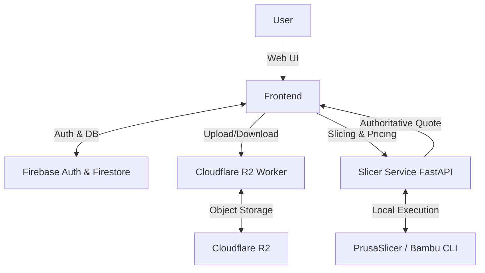

# AI Context

## 1. Project Identity

**Project:** Shilp Sahayak
**Description:** A precision 3D fabrication and e-commerce platform based in Patiala, Punjab, India.
**Application Type:** Monorepo containing a Web App (React SPA), API Service (FastAPI), and Edge Worker (Cloudflare).
**Primary Purpose:** Allows customers to browse a 3D printing catalog or upload custom 3D models for instant, authoritative quotes and automated slicing.
**Current Implementation Status:** Active development. Core frontend, custom printing workflow, and authoritative slicing API are implemented.

---

## 2. Tech Stack

| Area | Technology | Version | Notes |
|---|---|---|---|
| Language | TypeScript, Python | TS ^5.5.4, Py 3.12 | TS for frontend/worker, Python for slicer backend |
| Frontend | React + Vite + TailwindCSS | ^18.3.1, ^5.4.21 | Uses Three.js for 3D model rendering |
| Backend | FastAPI + Uvicorn | 0.115.6 | Interfaces with PrusaSlicer & Bambu Studio CLI |
| Database | Firebase Firestore | ^12.16.0 | NoSQL cloud database |
| Authentication | Firebase Auth | ^12.16.0 | Phone-based authentication primarily |
| State Management | Zustand | latest | `shilp-sahayak-store` localStorage persistence |
| Edge / Storage | Cloudflare Workers & R2 | - | Handles secure file uploads and object storage |
| Testing | Vitest, Pytest, Puppeteer | ^2.1.9, ^25.9.0 | Unit and E2E testing |

---

## 3. Architecture at a Glance

The project uses a 3-tier architecture. The Frontend communicates directly with Firestore for catalog and order management. For custom 3D printing workflows, the Frontend uploads files to Cloudflare R2 via the R2 Worker, then submits a slicing job to the Python Slicer Service. The Slicer Service performs authoritative slicing, pricing, and generates immutable quotes.



---

## 4. Critical Project Structure

| Path | Purpose | Important For |
|---|---|---|
| `frontend/src/App.tsx` | Main frontend entry and routing | Adding new pages, checking route protection |
| `frontend/src/store.ts` | Zustand state management | Global state, Cart logic, LocalStorage persistence |
| `slicer-service/app/main.py` | FastAPI entry point & endpoints | API routes, background slicing pipeline |
| `slicer-service/app/pricing_engine.py`| Authoritative server-side pricing | Changing cost calculations and quote generation |
| `slicer-service/app/slicer_adapters/` | External slicer integrations | Modifying Bambu/Prusa CLI arguments |
| `shilp-sahayak-r2/src/index.ts` | Cloudflare Worker entry point | Modifying file upload limits, CORS, JWT Auth |
| `firestore.rules` | Database security rules | Changing DB read/write permissions |

---

## 5. Core Modules

## Module: Slicing Pipeline (Backend)
**Location:** `slicer-service/app/`
**Purpose:** Handles end-to-end processing of 3D models.
**Responsibilities:**
- File inspection & mesh validation
- Routing (Single vs Multicolor vs Manual Review)
- Slicer execution (PrusaSlicer or Bambu Studio)
- Quote generation
**Depends on:** PrusaSlicer/Bambu Studio CLI
**Important files:** `main.py` (orchestrator), `slicer_router.py`, `pricing_engine.py`, `quote_store.py`

## Module: Custom Printing (Frontend)
**Location:** `frontend/src/services/` and `frontend/src/components/custom-printing/`
**Purpose:** Client-side workflow for uploading and quoting 3D models.
**Responsibilities:**
- Local model parsing (STL, OBJ, 3MF) and 3D rendering
- Instant client-side estimates (non-authoritative)
- Submission to Slicer Service
**Important files:** `modelParser.ts`, `ThreeModelViewer.tsx`, `instantEstimator.ts`, `slicingClient.ts`

## Module: R2 Storage (Worker)
**Location:** `shilp-sahayak-r2/src/`
**Purpose:** Secure file broker between users and Cloudflare R2.
**Responsibilities:**
- Validating Firebase JWTs
- Uploading/Downloading/Deleting models
**Important files:** `index.ts`

---

## 6. Core Features

| Feature | Entry Point | Main Logic | Data/API | Important Files |
|---|---|---|---|---|
| Shilp Studio (Custom Prints) | `/shilp-studio` | `slicer-service/app/main.py` | `POST /api/slice/jobs` | `CustomPrinting.tsx`, `slicingClient.ts` |
| E-commerce Catalog | `/shop` | `frontend/src/store.ts` | Firestore `products` | `Catalog.tsx`, `ProductCard.tsx` |
| Admin Dashboard | `/admin/dashboard` | Protected React Routes | Firestore | `AdminLayout.tsx`, `ProtectedRoute.tsx` |
| Checkout & Orders | `/checkout` | `frontend/src/store.ts` | Firestore `orders` | `Checkout.tsx` |

---

## 7. Request / Data Flow

**Custom 3D Printing Flow:**
```text
User uploads file
    ↓
Frontend parses locally & shows 3D Preview (Three.js)
    ↓
Frontend requests R2 upload via R2 Worker (Firebase JWT Auth)
    ↓
R2 Worker returns R2 Object Key
    ↓
Frontend POSTs `/api/slice/jobs` to Slicer Service
    ↓
Slicer Service downloads file, inspects, slices (CLI), and prices
    ↓
Slicer Service creates Immutable Quote Snapshot in memory (`quote_store.py`)
    ↓
Frontend polls for status & accepts quote
    ↓
Quote added to Zustand Cart -> Checkout -> Order saved in Firestore
```

---

## 8. Database Mental Model

The project uses Cloud Firestore (NoSQL).

*   **Users:** Authenticated users. Role field dictates Admin vs Customer access.
*   **Products & Categories:** E-commerce catalog data.
*   **Orders:** Customer purchases. Tied to User ID.
*   **Quotes:** Immutable custom 3D printing estimates.
*   **Settings:** App configuration, shipping rates, pricing constants.

*For complete schema, see `docs/DATABASE.md`.*

---

## 9. API Mental Model

| Method | Route | Purpose | Auth | Implementation |
|---|---|---|---|---|
| POST | `/api/slice/jobs` | Submit 3D model for slicing | None (Internal) | `slicer-service/app/main.py` |
| GET | `/api/slice/jobs/{id}`| Poll for job completion & quote | None (Internal) | `slicer-service/app/main.py` |
| POST | `/api/orders/payment` | Create server-side payment order | None | `slicer-service/app/payment_engine.py` |
| POST | `/upload` | Secure file upload to R2 | Firebase JWT | `shilp-sahayak-r2/src/index.ts` |
| GET | `/file?key=` | Download 3D model from R2 | Public | `shilp-sahayak-r2/src/index.ts` |

*For complete API details, see `docs/API.md`.*

---

## 10. Authentication & Authorization

*   **Mechanism:** Firebase Authentication (Primary: Phone OTP).
*   **Frontend:** `useAuth` hook tracks the current user. `useUserRole` checks Firestore for `'admin'` role. Routes are protected by `<CustomerRoute>` and `<ProtectedRoute>` (Admin).
*   **Edge (Worker):** Firebase ID tokens passed in `Authorization: Bearer <token>`. Verified using `jose` library and Google's JWKS.
*   **Backend (Slicer):** Currently lacks strict JWT middleware. Relies on UI/CORS and obfuscated job IDs.
*   **Database:** `firestore.rules` heavily guards data using `isSignedIn()` and `isAdmin()` functions.

---

## 11. External Services

| Service | Purpose | Integration Location | Configuration |
|---|---|---|---|
| Firebase | Auth, Firestore database | `frontend/src/lib/firebase.ts` | `VITE_FIREBASE_*` env vars |
| Cloudflare R2 | 3D Model object storage | `shilp-sahayak-r2/src/index.ts` | `wrangler.jsonc` |
| Bambu Studio CLI | Multicolor slicing | `slicer-service/app/slicer_adapters/` | Deployed in environment |
| PrusaSlicer | Single color slicing | `slicer-service/app/slice_core.py` | Deployed in environment |

---

## 12. Important Environment Variables

| Variable | Purpose | Required? | Used By |
|---|---|---|---|
| `VITE_FIREBASE_API_KEY` | Connects frontend to Firebase | Yes | Frontend |
| `VITE_CLOUDFLARE_WORKER_URL` | Routes frontend & slicer to R2 Worker | Yes | Frontend & Slicer |
| `ALLOWED_ORIGINS` | CORS configuration for Slicer API | Yes | Slicer Service |
| `PRUSASLICER_PATH` | Path to PrusaSlicer executable | No (falls back) | Slicer Service |

*See `docs/ENVIRONMENT_VARIABLES.md` for full list.*

---

## 13. Development Commands

```bash
# Start Frontend Web Server (Port 5173)
npm run dev

# Start Slicer Service API (Port 8000)
# (Requires: source slicer-service/venv/bin/activate)
npm run slicer:dev

# Start Cloudflare Worker local dev (Port 8787)
npm run worker:dev

# Run Frontend Tests
npm run test

# Build Frontend
npm run build
```

---

## 14. Coding Conventions

*   **Frontend:** React Functional components, strict TypeScript, Tailwind utility classes.
*   **State:** Zustand for global client state (Cart, Settings). Context/Hooks (`useProducts`) for Firestore synchronization.
*   **Backend:** Python 3.12 FastAPI, type-hinted, BackgroundTasks for async slicing, Pydantic for validation.
*   **Monorepo:** Organized as NPM Workspaces in the root `package.json`.

---

## 15. Important Invariants

*   **Pricing Authority:** The client NEVER dictates the final price of a custom print. The frontend calculates an "estimate", but the Slicer Service calculates the **authoritative immutable quote**. `POST /api/orders/payment` explicitly ignores `clientPrice`.
*   **Cart Identity:** Custom 3D prints in the cart use a composite key (`productId::variantId::customNotes::fileUrl`) to prevent identical base models with different uploaded files from merging quantities.
*   **File Isolation:** The R2 Worker enforces that users can only delete files under their specific `quotes/{uid}/` prefix.
*   **Build Envelope:** Slicer service strictly enforces that a model's dimensions do not exceed the selected printer's build envelope.

---

## 16. Safe Change Locations

| Task | Start Here | Also Check |
|---|---|---|
| Add Storefront Page | `frontend/src/pages/storefront/` | `App.tsx`, `StorefrontLayout.tsx` |
| Add Admin Page | `frontend/src/pages/admin/` | `App.tsx`, `AdminLayout.tsx` |
| Modify Slicer Routing | `slicer-service/app/slicer_router.py` | `file_inspector.py` |
| Update Quote Pricing | `slicer-service/app/pricing_engine.py` | Admin Settings panel in UI |
| Change Upload Limits | `shilp-sahayak-r2/src/index.ts` | `MAX_FILE_SIZE` constant |

---

## 17. Things AI Agents Should NOT Do

*   **Do not** trust client-side pricing logic for order fulfillment. The Slicer backend is the source of truth.
*   **Do not** modify `.env` configuration logic in `vite.config.ts`. Vite handles it automatically if the file is in `frontend/`.
*   **Do not** put Firebase Admin logic in the R2 Worker (it runs on V8 isolates, standard Node Firebase Admin SDK will fail. Stick to `jose` JWT parsing).
*   **Do not** bypass `firestore.rules`.
*   **Do not** use `python` command in scripts; Ubuntu setup requires `python3`.

---

## 18. Generated / Auto-Managed Files

| Path | Generated By | Should AI Edit? |
|---|---|---|
| `frontend/dist/` | Vite build process | No |
| `slicer-service/venv/` | Python venv | No |
| `slicer-service/storage/` | Slicer API (uploaded temp files) | No |
| `scratch/` | Debugging and E2E scripts | Yes, for testing purposes |

---

## 19. Testing Strategy

*   **Frontend:** `vitest` for unit tests (pricing logic, utils). Located alongside files or in `__tests__/` dirs.
*   **Backend:** `pytest` in `slicer-service/tests/`.
*   **E2E:** Puppeteer scripts in `e2e/` (testing the upload/slicing workflow).

*For full details, see `docs/TESTING.md`.*

---

## 20. Known Issues & Technical Debt

### Confirmed
*   **In-Memory Storage:** The Slicer Service stores job statuses and quotes in memory (`JOBS` dict, `quote_store.py`). Data is lost on server restart. Needs migration to Redis or Postgres.
*   **Wildcard CORS:** `ALLOWED_ORIGINS` defaults to `*` in the backend, which is overly permissive.
*   **Hardcoded Values:** Hardcoded Firebase Project ID in `shilp-sahayak-r2/src/index.ts`.

*For more details, see `docs/KNOWN_ISSUES.md`.*

---

## 21. Documentation Map

| Topic | Documentation |
|---|---|
| Master Index | `docs/README.md` |
| Architecture & Flows | `docs/ARCHITECTURE.md`, `docs/DATA_FLOW.md` |
| Frontend specific | `docs/FRONTEND.md`, `docs/STATE_MANAGEMENT.md` |
| Backend specific | `docs/BACKEND.md`, `docs/API.md` |
| DB & Auth | `docs/DATABASE.md`, `docs/AUTHENTICATION.md` |
| Setup & Deployment | `docs/SETUP.md`, `docs/DEPLOYMENT.md` |
| Operations | `docs/TROUBLESHOOTING.md`, `docs/CHANGE_GUIDE.md` |

---

## 22. AI Working Protocol

Before modifying code:

1. Read this file.
2. Identify the relevant module and read its detailed documentation in `docs/`.
3. Inspect the actual implementation before changing it.
4. Understand dependencies (e.g., changing pricing in the frontend means checking the backend `pricing_engine.py` to ensure parity).
5. Search for all usages of the code being changed using exact path matches.
6. Make the smallest change necessary.
7. Preserve existing architecture and conventions (e.g., Zustand for state, FastAPI BackgroundTasks for async work).
8. Do not invent APIs, services, environment variables, or database structures.
9. Do not expose secrets or API keys.
10. Update relevant documentation if the architecture or data flow changes.
11. Report anything uncertain (`NEEDS VERIFICATION`) rather than guessing.

