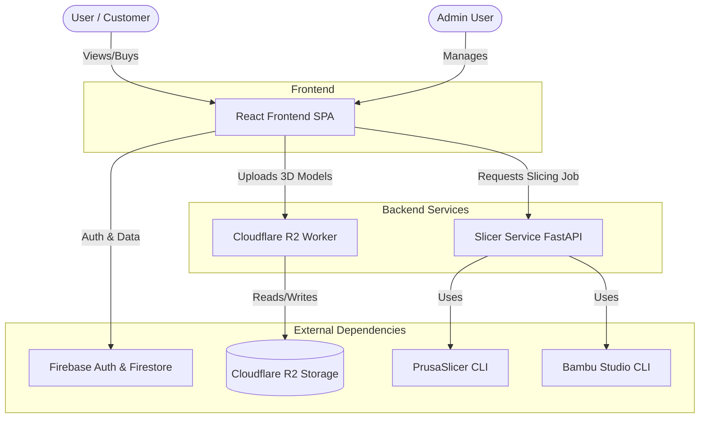
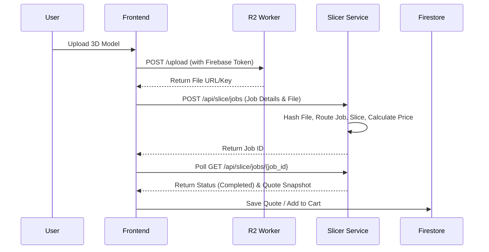

# Architecture

The Shilp Sahayak platform uses a modern decoupled architecture.

## System Context Diagram

## Component Architecture

1. **Frontend (Vercel)**
   - Deployed on Vercel.
   - Communicates directly with Firebase for auth and structured data.
   - Communicates with Slicer Service for custom print jobs.
   - Communicates with R2 Worker for uploading STL/OBJ files.

2. **Slicer Service (Render/Docker)**
   - A Python-based microservice running FastAPI.
   - Handles the computationally expensive task of slicing 3D models.
   - Validates printability and calculates precise material usage and print time.

3. **Cloudflare Worker (Cloudflare Edge)**
   - Edge worker handling file uploads.
   - Enforces max size limits (100MB), validates extensions, and checks Firebase auth tokens.

4. **Firebase Ecosystem**
   - **Authentication**: Phone-based auth (OTP).
   - **Firestore**: Primary NoSQL database for orders, users, products, and quotes.

## Data Flow: Custom Print Job

