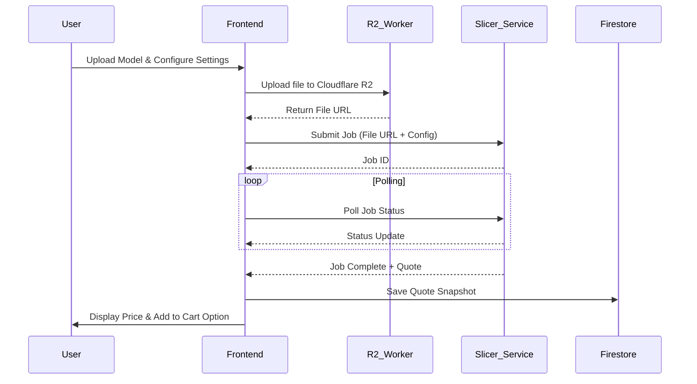
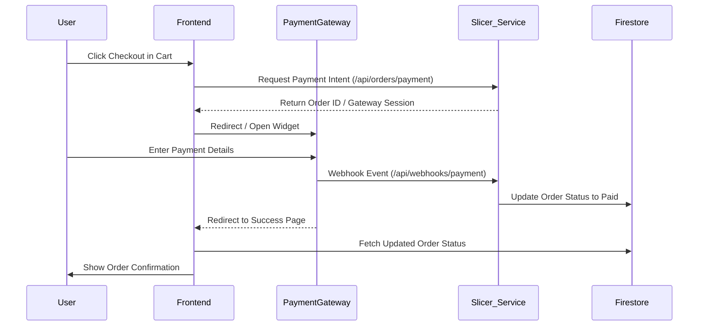

# Data Flow

## Custom Printing Data Flow

```mermaid
sequenceDiagram
    participant User
    participant Frontend
    participant R2_Worker
    participant Slicer_Service
    participant Firestore
    
    User->>Frontend: Upload Model & Configure Settings
    Frontend->>R2_Worker: Upload file to Cloudflare R2
    R2_Worker-->>Frontend: Return File URL
    Frontend->>Slicer_Service: Submit Job (File URL + Config)
    Slicer_Service-->>Frontend: Job ID
    
    loop Polling
        Frontend->>Slicer_Service: Poll Job Status
        Slicer_Service-->>Frontend: Status Update
    end
    
    Slicer_Service-->>Frontend: Job Complete + Quote
    Frontend->>Firestore: Save Quote Snapshot
    Frontend->>User: Display Price & Add to Cart Option
```

## Checkout Flow

```mermaid
sequenceDiagram
    participant User
    participant Frontend
    participant PaymentGateway
    participant Slicer_Service
    participant Firestore
    
    User->>Frontend: Click Checkout in Cart
    Frontend->>Slicer_Service: Request Payment Intent (/api/orders/payment)
    Slicer_Service-->>Frontend: Return Order ID / Gateway Session
    Frontend->>PaymentGateway: Redirect / Open Widget
    User->>PaymentGateway: Enter Payment Details
    PaymentGateway->>Slicer_Service: Webhook Event (/api/webhooks/payment)
    Slicer_Service->>Firestore: Update Order Status to Paid
    PaymentGateway-->>Frontend: Redirect to Success Page
    Frontend->>Firestore: Fetch Updated Order Status
    Frontend->>User: Show Order Confirmation
```
