# Shilp Sahayak Website: Comprehensive End-to-End Workflow Report

> **Investigation Note**: This report documents the **actual, complete, current state** of the Shilp Sahayak codebase as of September 2026. Every statement is grounded directly in repository source code (file and line references). Incomplete features, dead code, architectural mismatches, and paused subsystems are highlighted explicitly without omission.

---

## 1. Storefront & Catalog

### Product & Category Architecture
* **Data Source & Structure**:
  * Products are stored in Firestore under `/products/{productId}` and fetched via `useProducts()` ([`frontend/src/hooks/useProducts.ts#L46-L70`](file:///d:/Shilp%20buss/Supabase/New%20folder/Shilpsahayak/frontend/src/hooks/useProducts.ts#L46-L70)).
  * Categories are stored in Firestore under `/categories/{categoryId}` and fetched via `useCategories()` ([`frontend/src/hooks/useCategories.ts#L30-L50`](file:///d:/Shilp%20buss/Supabase/New%20folder/Shilpsahayak/frontend/src/hooks/useCategories.ts#L30-L50)).
  * Products contain fields such as `name`, `description`, `price`, `category`, `subcategory`, `image`, `images`, `stock`, `material`, `hasVariants`, `variants: ProductVariant[]`, `isCustomizable`, `active`, and `featured` ([`frontend/src/store.ts#L34-L54`](file:///d:/Shilp%20buss/Supabase/New%20folder/Shilpsahayak/frontend/src/store.ts#L34-L54)).
  * In the storefront catalog ([`frontend/src/pages/storefront/Catalog.tsx#L100-L240`](file:///d:/Shilp%20buss/Supabase/New%20folder/Shilpsahayak/frontend/src/pages/storefront/Catalog.tsx#L100-L240)), products are filtered client-side by search term, category/subcategory query params, material tags, stock status (`inStockOnly`), price slider range, and sorting (`featured`, `newest`, `price-low`, `price-high`). Products with `active === false` are excluded from display.

### Price Determination (Base Product vs Custom Print)
* **Standard Catalog Product**:
  * If a product has variants (`hasVariants === true`), the user selects a variant and the price resolves to `selectedVariant.price`. If no variant is selected or the product does not have variants, the price resolves to `product.price` ([`frontend/src/pages/storefront/ProductDetail.tsx#L210-L225`](file:///d:/Shilp%20buss/Supabase/New%20folder/Shilpsahayak/frontend/src/pages/storefront/ProductDetail.tsx#L210-L225)).
  * In the cart and checkout, product prices are evaluated as `item.customPrint?.customPrice ?? item.product.price` ([`frontend/src/pages/storefront/Checkout.tsx#L223-L225`](file:///d:/Shilp%20buss/Supabase/New%20folder/Shilpsahayak/frontend/src/pages/storefront/Checkout.tsx#L223-L225), [`frontend/src/pages/storefront/Cart.tsx#L85-L87`](file:///d:/Shilp%20buss/Supabase/New%20folder/Shilpsahayak/frontend/src/pages/storefront/Cart.tsx#L85-L87)).
* **Custom Prints**:
  * In the Custom Printing studio ([`frontend/src/pages/storefront/CustomPrinting.tsx#L750-L775`](file:///d:/Shilp%20buss/Supabase/New%20folder/Shilpsahayak/frontend/src/pages/storefront/CustomPrinting.tsx#L750-L775)), the displayed price is computed either by:
    1. An instant client-side geometric estimate via `calculateCustomerQuote()` ([`frontend/src/services/pricing/calculateQuote.ts#L100-L210`](file:///d:/Shilp%20buss/Supabase/New%20folder/Shilpsahayak/frontend/src/services/pricing/calculateQuote.ts#L100-L210)) based on bounding box volume, infill, print profile, and admin material rates (`usePricingSettings()`).
    2. An admin-reviewed quote price (`adminPrice`) sent to the customer upon manual quotation review ([`frontend/src/pages/admin/Quotes.tsx#L248-L255`](file:///d:/Shilp%20buss/Supabase/New%20folder/Shilpsahayak/frontend/src/pages/admin/Quotes.tsx#L248-L255)).
  * When added to cart, the custom print attaches a synthetic product with `id: custom-${Date.now()}` and stores the entire quotation specification in `customPrint.customPrice` ([`frontend/src/pages/storefront/CustomPrinting.tsx#L1338-L1379`](file:///d:/Shilp%20buss/Supabase/New%20folder/Shilpsahayak/frontend/src/pages/storefront/CustomPrinting.tsx#L1338-L1379)).

### Cart Storage & Session Persistence
* **State Management**: Cart state is managed entirely through Zustand with `persist` middleware ([`frontend/src/store.ts#L387-L465`](file:///d:/Shilp%20buss/Supabase/New%20folder/Shilpsahayak/frontend/src/store.ts#L387-L465)).
* **Storage Medium**: Stored strictly in browser `window.localStorage` under key `shilp-sahayak-store` ([`frontend/src/store.ts#L727-L765`](file:///d:/Shilp%20buss/Supabase/New%20folder/Shilpsahayak/frontend/src/store.ts#L727-L765)).
* **Cross-session & Cross-device Behavior**:
  * The cart persists across browser refreshes and browser restarts **on the same browser and device**.
  * **There is NO server-side or Firestore cart sync**. The cart is completely invisible across different devices or separate browsers, even if the user logs into the same account.
* **Cart Item Identity**:
  * Generated by `getCartItemId()` ([`frontend/src/store.ts#L361-L381`](file:///d:/Shilp%20buss/Supabase/New%20folder/Shilpsahayak/frontend/src/store.ts#L361-L381)) combining `productId`, `variantId`, `customNotes`, and `customPrintId` (file URL or file name). This prevents custom print uploads from colliding with each other or standard items.

---

## 2. Custom Print / Quote Flow

### Upload Flow & Client-Side Detection
* **File Types Accepted**:
  * Frontend accepts `.stl`, `.obj`, `.3mf`, and `.zip` archive containers ([`frontend/src/services/model/modelParser.ts#L152`](file:///d:/Shilp%20buss/Supabase/New%20folder/Shilpsahayak/frontend/src/services/model/modelParser.ts#L152), [`frontend/src/pages/storefront/CustomPrinting.tsx#L1050-L1090`](file:///d:/Shilp%20buss/Supabase/New%20folder/Shilpsahayak/frontend/src/pages/storefront/CustomPrinting.tsx#L1050-L1090)).
  * Cloudflare Worker upload endpoint enforces `.stl`, `.obj`, `.3mf`, `.zip`, `.png`, `.jpg`, `.jpeg`, `.webp` up to 100 MB (`MAX_FILE_SIZE = 100 * 1024 * 1024`) ([`shilp-sahayak-r2/src/index.ts#L26-L37`](file:///d:/Shilp%20buss/Supabase/New%20folder/Shilpsahayak/shilp-sahayak-r2/src/index.ts#L26-L37), [`shilp-sahayak-r2/src/index.ts#L1510-L1531`](file:///d:/Shilp%20buss/Supabase/New%20folder/Shilpsahayak/shilp-sahayak-r2/src/index.ts#L1510-L1531)).
* **Auto-Detected Client-Side**:
  * Parsed via Three.js loaders (`STLLoader`, `OBJLoader`, `ThreeMFLoader`, `unzipSync`) in [`frontend/src/services/model/modelParser.ts`](file:///d:/Shilp%20buss/Supabase/New%20folder/Shilpsahayak/frontend/src/services/model/modelParser.ts):
    * **Dimensions**: Bounding box size along X, Y, Z in mm (`analyzeGeometry`, [`frontend/src/services/model/modelParser.ts#L180-L240`](file:///d:/Shilp%20buss/Supabase/New%20folder/Shilpsahayak/frontend/src/services/model/modelParser.ts#L180-L240)).
    * **Volume**: Signed tetrahedron summation across triangle face indices to calculate geometric volume in cm³ (`signedVolumeOfTriangle`, [`frontend/src/services/model/modelParser.ts#L16-L22`](file:///d:/Shilp%20buss/Supabase/New%20folder/Shilpsahayak/frontend/src/services/model/modelParser.ts#L16-L22)).
    * **Colors**: Color presence, palette sampling, vertex colors, and UV texture maps (`detectOriginalColors`, [`frontend/src/services/model/modelParser.ts#L32-L138`](file:///d:/Shilp%20buss/Supabase/New%20folder/Shilpsahayak/frontend/src/services/model/modelParser.ts#L32-L138)).
    * **Weight & Print Time**: Estimated via geometry heuristics (`volumeCm3 * density * infill` + wall volume factor) in [`frontend/src/services/pricing/instantEstimator.ts#L120-L175`](file:///d:/Shilp%20buss/Supabase/New%20folder/Shilpsahayak/frontend/src/services/pricing/instantEstimator.ts#L120-L175). Slicer toolpath generation is **paused/stubbed** ([`frontend/src/pages/storefront/CustomPrinting.tsx#L845-L857`](file:///d:/Shilp%20buss/Supabase/New%20folder/Shilpsahayak/frontend/src/pages/storefront/CustomPrinting.tsx#L845-L857)).
* **File Storage**:
  * Files are uploaded to **Cloudflare R2** via `upload3DFile` calling `POST /upload` on the Cloudflare Worker ([`frontend/src/utils/uploadFile.ts#L80-L135`](file:///d:/Shilp%20buss/Supabase/New%20folder/Shilpsahayak/frontend/src/utils/uploadFile.ts#L80-L135), [`shilp-sahayak-r2/src/index.ts#L1491-L1578`](file:///d:/Shilp%20buss/Supabase/New%20folder/Shilpsahayak/shilp-sahayak-r2/src/index.ts#L1491-L1578)).
  * The object key is structured as `quotes/{uid}/{timestamp}_{random}_{sanitizedFileName}` ([`shilp-sahayak-r2/src/index.ts#L1543`](file:///d:/Shilp%20buss/Supabase/New%20folder/Shilpsahayak/shilp-sahayak-r2/src/index.ts#L1543)). If the user is unauthenticated at upload time, `uid` defaults to `guest`.

### Firestore Document Creation
* **Submission Trigger**: Customer fills in parameters and clicks "Request Engineer Review" ([`frontend/src/pages/storefront/CustomPrinting.tsx#L1489-L1520`](file:///d:/Shilp%20buss/Supabase/New%20folder/Shilpsahayak/frontend/src/pages/storefront/CustomPrinting.tsx#L1489-L1520)).
* **Target Collection**: `quotes/{quoteId}` via `useSubmitQuote()` ([`frontend/src/hooks/useQuotes.ts#L222-L259`](file:///d:/Shilp%20buss/Supabase/New%20folder/Shilpsahayak/frontend/src/hooks/useQuotes.ts#L222-L259)).
* **Fields Written**:
  * `customerId`: string (current authenticated user UID)
  * `customerName`: string
  * `customerEmail`: string
  * `customerPhone`: string
  * `requestType`: `'3d-model'`
  * `date`: string (ISO timestamp)
  * `status`: `'Pending'` (enforced by hook line 236)
  * `fileName`: string
  * `fileUrl`: string (R2 object key)
  * `fileSizeBytes`: number
  * `material`: string (e.g. `'PLA'`)
  * `color`: string (e.g. `'Black'`)
  * `quality`: string (profile name)
  * `infill`: number
  * `layerHeight`: number
  * `supports`: boolean
  * `quantity`: number
  * `packagingIncluded`: boolean
  * `volume`: number (cm³)
  * `estimatedWeight`: number (grams)
  * `estimatedPrintTimeHours`: number
  * `systemEstimatedPrice`: number
  * `estimatedPrice`: number
  * `dimensions`: `{ length, width, height, unit: 'mm' }`
  * `notes`: string (user notes + selected presets)
  * `pricingVersion`: string
* **Guest Submission Rule**: Unauthenticated visitors **cannot** submit quotes directly. If a guest attempts submission, their model is uploaded under `guest/`, their configuration is stored in `sessionStorage('shilp_studio_saved_quote')`, and they are redirected to `/login?redirect=/shilp-studio` ([`frontend/src/pages/storefront/CustomPrinting.tsx#L1406-L1471`](file:///d:/Shilp%20buss/Supabase/New%20folder/Shilpsahayak/frontend/src/pages/storefront/CustomPrinting.tsx#L1406-L1471)).

### Admin Review & Status Transitions
* **Location in Admin Panel**: Located at `/admin/quotes` ([`frontend/src/pages/admin/Quotes.tsx`](file:///d:/Shilp%20buss/Supabase/New%20folder/Shilpsahayak/frontend/src/pages/admin/Quotes.tsx)) with a review drawer in [`frontend/src/components/admin/quotes/QuoteReviewDrawer.tsx`](file:///d:/Shilp%20buss/Supabase/New%20folder/Shilpsahayak/frontend/src/components/admin/quotes/QuoteReviewDrawer.tsx).
* **Manual Admin Inputs**:
  * `adminPrice`: number (admin overrides or confirms price)
  * `adminNotes`: string (notes or instructions for customer)
  * `expiryDays`: number (48 hours, 3 days, 7 days, 14 days, 30 days, or 0 for no expiration)
* **Status Transitions Available to Admin**:
  * `New Request` / `Pending`
  * `Under Review`
  * `Quote Sent` (triggered via `onSendQuote` / `handleSendQuote` in [`frontend/src/pages/admin/Quotes.tsx#L236-L290`](file:///d:/Shilp%20buss/Supabase/New%20folder/Shilpsahayak/frontend/src/pages/admin/Quotes.tsx#L236-L290))
  * `Approved`
  * `Converted to Order` (triggers `useCreateOrder()` creating an order with status `'Pending'`, then updates quote with `orderId` and `status: 'Converted to Order'`)
  * `Rejected`
  * `Cancelled`

### Email Sent to Customer When Quoted
* **Trigger**: Invocation of `handleSendQuote()` in [`frontend/src/pages/admin/Quotes.tsx#L259-L264`](file:///d:/Shilp%20buss/Supabase/New%20folder/Shilpsahayak/frontend/src/pages/admin/Quotes.tsx#L259-L264), calling `sendQuoteReadyNotification()` in [`frontend/src/services/emailNotifications.ts#L83-L179`](file:///d:/Shilp%20buss/Supabase/New%20folder/Shilpsahayak/frontend/src/services/emailNotifications.ts#L83-L179).
* **Delivery Mechanism**: Writes an email job to Firestore collection `mail/{mailId}` with `type: 'quote_ready'`, `status: 'queued'`. It relies on the Firebase "Trigger Email" extension or background function to process the queue.
* **Exact Content**:
  * **Subject**: `Your 3D Print Quote #{quoteId.slice(0, 8)} is Ready — ₹{price}`
  * **Body**: Shilp Sahayak banner, greeting `Hello {customerName}`, model name, highlighted price box with formatted INR (`₹{price}`), validity date (`⏳ Offer valid until: {expiryFormatted}`), specifications table (File, Material, Color, Infill, Quantity), CTA button linking to `{origin}/account` ("Review & Accept Quote ➔").

### Customer Options on Quoted Price & Governing Firestore Rule
* **Customer Options Today**:
  * In the customer account dashboard at `/account` under the Quotes tab ([`frontend/src/pages/storefront/Account.tsx#L940-L960`](file:///d:/Shilp%20buss/Supabase/New%20folder/Shilpsahayak/frontend/src/pages/storefront/Account.tsx#L940-L960)):
    * If `quote.status === 'Quoted'` (or `'Quote Sent'`) and `adminPrice` is set, and the quote has not expired:
      * **Accept**: Calls `handleAcceptQuote(quote.id)` updating quote status to `'Accepted'` ([`frontend/src/pages/storefront/Account.tsx#L399-L407`](file:///d:/Shilp%20buss/Supabase/New%20folder/Shilpsahayak/frontend/src/pages/storefront/Account.tsx#L399-L407)).
      * **Decline**: Prompts a confirm dialog, then calls `handleRejectQuote(quote.id)` updating quote status to `'Rejected'` ([`frontend/src/pages/storefront/Account.tsx#L409-L425`](file:///d:/Shilp%20buss/Supabase/New%20folder/Shilpsahayak/frontend/src/pages/storefront/Account.tsx#L409-L425)).
* **Governing Firestore Security Rule**:
  * Located at [`firestore.rules#L149-L161`](file:///d:/Shilp%20buss/Supabase/New%20folder/Shilpsahayak/firestore.rules#L149-L161):
    ```javascript
    allow update: if
      isAdmin()
      ||
      (
        isSignedIn() &&
        resource.data.customerId == request.auth.uid &&
        resource.data.status == 'Quoted' &&
        request.resource.data.status in ['Accepted', 'Rejected'] &&
        request.resource.data
          .diff(resource.data)
          .affectedKeys()
          .hasOnly(['status'])
      );
    ```
  * **Crucial Rule Gap / Discrepancy**:
    * Notice the security rule demands: `resource.data.status == 'Quoted'`.
    * When the admin clicks "Send Quote" in [`frontend/src/pages/admin/Quotes.tsx#L251`](file:///d:/Shilp%20buss/Supabase/New%20folder/Shilpsahayak/frontend/src/pages/admin/Quotes.tsx#L251), the admin sets `status: 'Quote Sent'`.
    * If a quote document has `status == 'Quote Sent'` instead of `'Quoted'`, a customer calling `updateDoc` will be **permission-denied by Firestore rules** because `resource.data.status == 'Quoted'` evaluates to `false`!

### Expiry Mechanism Today
* **Existence of Mechanism**:
  * When an admin sends a quote, `expiresAt` is set to an ISO date string (`now + expiryDays`) ([`frontend/src/pages/admin/Quotes.tsx#L245-L252`](file:///d:/Shilp%20buss/Supabase/New%20folder/Shilpsahayak/frontend/src/pages/admin/Quotes.tsx#L245-L252)).
  * In both the Admin list ([`frontend/src/pages/admin/Quotes.tsx#L146-L153`](file:///d:/Shilp%20buss/Supabase/New%20folder/Shilpsahayak/frontend/src/pages/admin/Quotes.tsx#L146-L153)) and Customer Account ([`frontend/src/pages/storefront/Account.tsx#L879-L882`](file:///d:/Shilp%20buss/Supabase/New%20folder/Shilpsahayak/frontend/src/pages/storefront/Account.tsx#L879-L882)), the UI calculates client-side:
    `isExpired = quote.expiresAt ? new Date(quote.expiresAt).getTime() < Date.now() : false;`
  * If expired, the customer UI replaces the "Accept" and "Decline" buttons with a badge reading "Expired" and a "Contact Studio" button ([`frontend/src/pages/storefront/Account.tsx#L961-L966`](file:///d:/Shilp%20buss/Supabase/New%20folder/Shilpsahayak/frontend/src/pages/storefront/Account.tsx#L961-L966)).
  * **However, there is NO background cron job or scheduled worker expiring quotes in Firestore**. The document in the database stays in its original status forever unless manually updated by an admin.

### Payment of Accepted Quotes (Worker Pricing Discrepancy)
* **How an Accepted Quote Becomes Payable**:
  * In the customer UI today, **there is NO direct "Pay Now" button on an accepted quote**.
  * The only route to convert a quote into an order is for the **Admin** to manually click "Convert to Order" in `/admin/quotes` ([`frontend/src/pages/admin/Quotes.tsx#L293-L364`](file:///d:/Shilp%20buss/Supabase/New%20folder/Shilpsahayak/frontend/src/pages/admin/Quotes.tsx#L293-L364)), which calls `useCreateOrder()` ([`frontend/src/hooks/useOrders.ts#L485-L540`](file:///d:/Shilp%20buss/Supabase/New%20folder/Shilpsahayak/frontend/src/hooks/useOrders.ts#L485-L540)) writing an order document directly with `status: 'Pending'`.
* **Does the Cloudflare Worker trust the quote's price or only `products/{id}`?**
  * When a customer pays through the standard checkout flow (`POST /api/payment/create-order`), the Cloudflare Worker executes `calculateOrderPricing()` ([`shilp-sahayak-r2/src/index.ts#L534-L637`](file:///d:/Shilp%20buss/Supabase/New%20folder/Shilpsahayak/shilp-sahayak-r2/src/index.ts#L534-L637)).
  * Look at lines 578-588:
    ```typescript
    const product = await getFirestoreDoc(projectId, "products", item.productId, apiKey, authToken);
    if (!product) {
      throw new Error(`Product ${item.productId} was not found.`);
    }
    ```
  * **The Worker ONLY resolves prices from `products/{productId}`**!
  * If a custom quote item has `productId: custom-1727...` or `productId: custom-QT-2001`, **the Cloudflare Worker fails with `Product custom-... was not found` (HTTP 400)**.
  * In other words, **the server-authoritative checkout route cannot process custom prints or custom quotes because custom items do not exist in the Firestore `products` catalog collection**.

---

## 3. Account & Auth

### Sign-Up / Sign-In Methods
* **Supported Providers** ([`frontend/src/hooks/useAuth.ts#L122-L260`](file:///d:/Shilp%20buss/Supabase/New%20folder/Shilpsahayak/frontend/src/hooks/useAuth.ts#L122-L260)):
  1. **Email / Password**: `signInWithEmailAndPassword`, `createUserWithEmailAndPassword`
  2. **Google Sign-In**: `signInWithPopup` via `GoogleAuthProvider`
  3. **Microsoft Sign-In**: `signInWithPopup` via `OAuthProvider('microsoft.com')`
* **What is written to `users/{uid}` and when**:
  * **On Email/Password Registration** ([`frontend/src/hooks/useAuth.ts#L168-L188`](file:///d:/Shilp%20buss/Supabase/New%20folder/Shilpsahayak/frontend/src/hooks/useAuth.ts#L168-L188)):
    `setDoc(doc(db, 'users', result.user.uid), { uid, name, email, phone, emailVerified: false, address: { line1: '', line2: '', city: '', state: '', pincode: '' }, role: 'customer', createdAt: serverTimestamp(), updatedAt: serverTimestamp() }, { merge: true })`
  * **On Google / Microsoft Sign-In** ([`frontend/src/hooks/useAuth.ts#L202-L221`](file:///d:/Shilp%20buss/Supabase/New%20folder/Shilpsahayak/frontend/src/hooks/useAuth.ts#L202-L221), [`L235-L255`](file:///d:/Shilp%20buss/Supabase/New%20folder/Shilpsahayak/frontend/src/hooks/useAuth.ts#L235-L255)):
    Checks `getDoc(userRef)`. If the document does not exist, creates the document with `emailVerified: true` (OAuth providers are treated as verified), `role: 'customer'`, and blank address.

### Account Capabilities & Missing Features
* **What a customer can view/edit today** ([`frontend/src/pages/storefront/Account.tsx`](file:///d:/Shilp%20buss/Supabase/New%20folder/Shilpsahayak/frontend/src/pages/storefront/Account.tsx)):
  * **Profile**: View and edit Name, Email, Phone number ([`Account.tsx#L285-L337`](file:///d:/Shilp%20buss/Supabase/New%20folder/Shilpsahayak/frontend/src/pages/storefront/Account.tsx#L285-L337)). Updating email triggers `updateEmail(currentUser, cleanEmail)` and sends a new verification link.
  * **Addresses**: Edit and save a single profile delivery address (`line1`, `line2`, `city`, `state`, `pincode`) with auto PIN code lookup ([`Account.tsx#L339-L385`](file:///d:/Shilp%20buss/Supabase/New%20folder/Shilpsahayak/frontend/src/pages/storefront/Account.tsx#L339-L385)).
  * **Order History**: Real-time listing of customer orders with status badges, item lists, order tracking info, "Cancel Order" button (if cancellable), and "Order Again" button ([`Account.tsx#L645-L824`](file:///d:/Shilp%20buss/Supabase/New%20folder/Shilpsahayak/frontend/src/pages/storefront/Account.tsx#L645-L824)).
  * **Quotes**: List of user-submitted custom CAD quotation requests with material specs, review status, price breakdown, and accept/decline buttons ([`Account.tsx#L827-L984`](file:///d:/Shilp%20buss/Supabase/New%20folder/Shilpsahayak/frontend/src/pages/storefront/Account.tsx#L827-L984)).
* **Missing Features / Discrepancies**:
  1. **Multiple Saved Addresses**: Only a single address object is stored in `users/{uid}.address`. There is no address book or ability to select among multiple addresses.
  2. **Delete Account**: There is **no UI or functionality for a user to delete their account**. Under Firestore rules ([`firestore.rules#L51`](file:///d:/Shilp%20buss/Supabase/New%20folder/Shilpsahayak/firestore.rules#L51)), `allow delete: if isAdmin();`, so customers cannot delete their Firestore user document even if they wanted to.
  3. **Address Reuse in Checkout**: In Checkout ([`frontend/src/pages/storefront/Checkout.tsx#L208-L215`](file:///d:/Shilp%20buss/Supabase/New%20folder/Shilpsahayak/frontend/src/pages/storefront/Checkout.tsx#L208-L215)), the profile address auto-fills into the form fields if `savedForm` in `sessionStorage` is empty, but saving new addresses at checkout does not write back to `users/{uid}`.

### Email Verification Requirements
* **Is email verification required for any customer action today?**
  * **NO. Email verification is NEVER blocking anywhere in the application.**
  * In Registration ([`frontend/src/hooks/useAuth.ts#L156-L165`](file:///d:/Shilp%20buss/Supabase/New%20folder/Shilpsahayak/frontend/src/hooks/useAuth.ts#L156-L165)), `sendEmailVerification` is dispatched in a try/catch block, but failures do not stop registration.
  * In Account ([`frontend/src/pages/storefront/Account.tsx#L584-L611`](file:///d:/Shilp%20buss/Supabase/New%20folder/Shilpsahayak/frontend/src/pages/storefront/Account.tsx#L584-L611)), an "Email Verified" or "Send Verification Link" badge is displayed.
  * In Checkout ([`frontend/src/pages/storefront/Checkout.tsx#L634-L662`](file:///d:/Shilp%20buss/Supabase/New%20folder/Shilpsahayak/frontend/src/pages/storefront/Checkout.tsx#L634-L662)), if `!user.emailVerified`, an amber "Email Verification Notice" banner appears with a "Resend Verification Email" button, **but it does not disable the submit/pay button or block checkout in any way**. Unverified users can place orders and pay without issue.

---

## 4. Checkout & Payment

### Path from Cart to Paid Order: Cloudflare Worker Endpoints
The complete transaction sequence is:
1. **Frontend Initiation**:
   * Customer fills shipping address and clicks "Pay Now" in [`frontend/src/pages/storefront/Checkout.tsx#L275-L420`](file:///d:/Shilp%20buss/Supabase/New%20folder/Shilpsahayak/frontend/src/pages/storefront/Checkout.tsx#L275-L420).
   * Dynamically loads Razorpay checkout script from `https://checkout.razorpay.com/v1/checkout.js` via `loadRazorpayScript()` ([`frontend/src/services/paymentService.ts#L71-L92`](file:///d:/Shilp%20buss/Supabase/New%20folder/Shilpsahayak/frontend/src/services/paymentService.ts#L71-L92)).
2. **Order Creation Request**:
   * Calls `POST /api/payment/create-order` on the Cloudflare Worker with `Authorization: Bearer <FirebaseIdToken>` ([`frontend/src/services/paymentService.ts#L98-L125`](file:///d:/Shilp%20buss/Supabase/New%20folder/Shilpsahayak/frontend/src/services/paymentService.ts#L98-L125)).
3. **Cloudflare Worker Server-Side Order Execution** ([`shilp-sahayak-r2/src/index.ts#L747-L974`](file:///d:/Shilp%20buss/Supabase/New%20folder/Shilpsahayak/shilp-sahayak-r2/src/index.ts#L747-L974)):
   * Verifies Firebase ID token JWT (`authenticateUser`) and exchanges service account credentials for a privileged Google OAuth2 access token (`getPrivilegedFirestoreAccessToken`).
   * Fetches each item from Firestore `/products/{productId}` to check existence, active flag, stock sufficiency, and unit price.
   * Fetches `/settings/settings` to determine `shippingFlatRate` (default ₹150) and `freeShippingThreshold` (default ₹499).
   * Calculates subtotal, shipping, and total. Compares against `clientCalculatedTotal` to reject price manipulation.
   * Calls Razorpay API (`POST https://api.razorpay.com/v1/orders`) with `amount` (in paise), `currency: "INR"`, `receipt: orderId`, and `payment_capture: 1`.
   * Writes the pending order to Firestore `/orders/{orderId}` with `status: 'Pending'`, `paymentStatus: 'Pending'`, `timeline`, and `razorpayOrderId`.
   * Returns `{ success: true, orderId, razorpayOrderId, amount, currency, keyId, pricing }`.
4. **Gateway Modal & Customer Payment**:
   * Frontend opens Razorpay modal with `rzp = new (window as any).Razorpay(...)` ([`frontend/src/pages/storefront/Checkout.tsx#L426-L492`](file:///d:/Shilp%20buss/Supabase/New%20folder/Shilpsahayak/frontend/src/pages/storefront/Checkout.tsx#L426-L492)).
   * Customer enters card, UPI, or netbanking credentials.
5. **Cryptographic Verification**:
   * Razorpay modal handler returns `{ razorpay_payment_id, razorpay_order_id, razorpay_signature }`.
   * Frontend calls `POST /api/payment/verify` on the Cloudflare Worker with Bearer token ([`frontend/src/services/paymentService.ts#L131-L150`](file:///d:/Shilp%20buss/Supabase/New%20folder/Shilpsahayak/frontend/src/services/paymentService.ts#L131-L150)).
6. **Cloudflare Worker Payment Finalization** ([`shilp-sahayak-r2/src/index.ts#L980-L1190`](file:///d:/Shilp%20buss/Supabase/New%20folder/Shilpsahayak/shilp-sahayak-r2/src/index.ts#L980-L1190)):
   * Re-reads order from Firestore. Checks customer ownership (`existingOrder.customerId === uid`).
   * Validates HMAC SHA-256 signature over `${existingOrder.razorpayOrderId}|${razorpayPaymentId}` with `RAZORPAY_KEY_SECRET`.
   * Calls `GET https://api.razorpay.com/v1/payments/{paymentId}` to verify status is `"captured"`, amount matches `order.total * 100`, and currency is `"INR"`.
   * Patches Firestore order document with `paymentStatus: 'Paid'`, `status: 'Confirmed'`, `paymentId`, `paidAt`, and adds a timeline event.
   * Writes order confirmation email to Firestore `/mail/{mailDocId}`.
   * Returns `{ success: true, orderId, paymentId, status: "Confirmed", paymentStatus: "Paid" }`.
7. **Alternative Asynchronous Path: Razorpay Webhook**:
   * If customer closes the browser before frontend verification completes, Razorpay sends webhook to `POST /api/payment/webhook` ([`shilp-sahayak-r2/src/index.ts#L1194-L1488`](file:///d:/Shilp%20buss/Supabase/New%20folder/Shilpsahayak/shilp-sahayak-r2/src/index.ts#L1194-L1488)).
   * Worker verifies `X-Razorpay-Signature`, checks idempotency in `/webhook_events/{eventId}`, patches order to `paymentStatus: 'Paid'`, `status: 'Confirmed'`, and enqueues confirmation email if not already sent.

### Calculation of Charged Amount (Client vs Server)
* **Client**: Computes preview subtotal, shipping (free over ₹499 or ₹150 flat rate), and total in [`frontend/src/pages/storefront/Checkout.tsx#L226-L235`](file:///d:/Shilp%20buss/Supabase/New%20folder/Shilpsahayak/frontend/src/pages/storefront/Checkout.tsx#L226-L235).
* **Server**: **Authoritative calculation is 100% computed on the Cloudflare Worker server** ([`shilp-sahayak-r2/src/index.ts#L534-L637`](file:///d:/Shilp%20buss/Supabase/New%20folder/Shilpsahayak/shilp-sahayak-r2/src/index.ts#L534-L637)). The client value is only sent as `clientCalculatedTotal` to detect tampering: if `|clientTotal - serverTotal| > 0.01`, the Worker aborts with HTTP 400.

### Order Statuses & Setting Locations
The application defines and uses the following statuses:

| Status | Where Set in Code | Actor / Component |
| :--- | :--- | :--- |
| **Pending** | `shilp-sahayak-r2/src/index.ts#L926`<br>`frontend/src/hooks/useOrders.ts#L521`<br>`frontend/src/pages/admin/Quotes.tsx#L302` | Worker `create-order`<br>Frontend `useCreateOrder`<br>Admin Quote conversion |
| **Confirmed** | `shilp-sahayak-r2/src/index.ts#L1117`<br>`shilp-sahayak-r2/src/index.ts#L1333`<br>`frontend/src/pages/admin/OrderDetail.tsx#L40` | Worker `/verify`<br>Worker Webhook `payment.captured`<br>Admin OrderDetail |
| **Processing** | `frontend/src/hooks/useOrders.ts#L580-L625`<br>`frontend/src/pages/admin/OrderDetail.tsx#L41` | Admin status dropdown |
| **Ready to ship** | `frontend/src/hooks/useOrders.ts#L787`<br>`frontend/src/pages/admin/OrderDetail.tsx#L42` | Auto-synced when shipping status is 'Ready to ship' or set via Admin dropdown |
| **Shipped** | `frontend/src/hooks/useOrders.ts#L625`<br>`frontend/src/hooks/useOrders.ts#L789`<br>`frontend/src/pages/admin/OrderDetail.tsx#L43` | Admin status dropdown or synced when shipping status is 'Shipped' |
| **Delivered** | `frontend/src/hooks/useOrders.ts#L625`<br>`frontend/src/hooks/useOrders.ts#L791`<br>`frontend/src/pages/admin/OrderDetail.tsx#L44` | Admin status dropdown or synced when shipping status is 'Delivered' |
| **Cancelled** | `frontend/src/hooks/useOrders.ts#L1246`<br>`frontend/src/pages/storefront/Account.tsx#L476`<br>`frontend/src/pages/admin/OrderDetail.tsx#L45` | Customer cancellation in Account or Admin OrderDetail |
| **Refunded** | `frontend/src/pages/admin/OrderDetail.tsx#L46` | Admin status dropdown |
| **Printing** *(legacy)* | `frontend/src/pages/admin/OrderDetail.tsx#L48` | Admin status dropdown (maintained for backwards compatibility) |
| **Quality Check** *(legacy)*| `frontend/src/pages/admin/OrderDetail.tsx#L49` | Admin status dropdown (maintained for backwards compatibility) |

### Cancellation & Refund Handling
* **Customer-Side Cancellation Rule (Current Behavior)**:
  * In [`frontend/src/pages/storefront/Account.tsx#L449-L466`](file:///d:/Shilp%20buss/Supabase/New%20folder/Shilpsahayak/frontend/src/pages/storefront/Account.tsx#L449-L466), an order is cancellable by a customer **ONLY IF**:
    1. `order.status === 'Pending'` OR `order.status === 'Confirmed'` (i.e. before fabrication begins).
    2. `order.isCancellable !== false`.
    3. None of the line items have `isCancellable === false`.
  * In [`frontend/src/hooks/useOrders.ts#L1237-L1242`](file:///d:/Shilp%20buss/Supabase/New%20folder/Shilpsahayak/frontend/src/hooks/useOrders.ts#L1237-L1242), `useCancelOrder` enforces:
    `if (orderData.status !== 'Pending' && orderData.status !== 'Confirmed') throw new Error('Cannot cancel order... fabrication or dispatch has already commenced.')`.
* **Paid Orders Cancellation (Block vs Allow)**:
  * **Option C behavior is implemented with respect to fabrication stage**: A paid order that is in `status === 'Confirmed'` CAN be cancelled by the customer before printing commences.
  * Once the admin shifts the status to `Processing`, `Printing`, `Ready to ship`, or `Shipped`, **customer cancellation is strictly blocked**.
* **Refund Execution**:
  * When a customer cancels, the frontend updates `orders/{id}` with `status: 'Cancelled'`, automatically restores catalogue inventory stock ([`useOrders.ts#L1252-L1285`](file:///d:/Shilp%20buss/Supabase/New%20folder/Shilpsahayak/frontend/src/hooks/useOrders.ts#L1252-L1285)), and queues an email notification `sendOrderCancelledNotification` ([`useOrders.ts#L1289-L1294`](file:///d:/Shilp%20buss/Supabase/New%20folder/Shilpsahayak/frontend/src/hooks/useOrders.ts#L1289-L1294)).
  * **CRITICAL GATEWAY GAP**: **There is NO automated Razorpay refund call (`/payments/{id}/refund`)**. The cancellation writes to Firestore and sends an email promising a refund in 2–3 business days, but the money is NOT refunded automatically by the system. The admin must manually log into the Razorpay Dashboard to execute the refund.

---

## 5. Post-Order: Admin Operations

### Order Management & Customer-Facing Effects
* **Admin Order Screens**:
  * List: `/admin/orders` ([`frontend/src/pages/admin/Orders.tsx`](file:///d:/Shilp%20buss/Supabase/New%20folder/Shilpsahayak/frontend/src/pages/admin/Orders.tsx))
  * Detail: `/admin/orders/:id` ([`frontend/src/pages/admin/OrderDetail.tsx`](file:///d:/Shilp%20buss/Supabase/New%20folder/Shilpsahayak/frontend/src/pages/admin/OrderDetail.tsx))
* **Actions Available**:
  * Change overall status (`useUpdateOrderStatus`, [`frontend/src/hooks/useOrders.ts#L577-L640`](file:///d:/Shilp%20buss/Supabase/New%20folder/Shilpsahayak/frontend/src/hooks/useOrders.ts#L577-L640)): Updates status, appends to `timeline`.
    * **Customer Effect**: Calls `sendOrderStatusUpdateNotification()`, which enqueues an email to `mail` collection with the new status and tracking number.
  * Update Shipping Details (`useUpdateShippingDetails`, [`frontend/src/hooks/useOrders.ts#L734-L820`](file:///d:/Shilp%20buss/Supabase/New%20folder/Shilpsahayak/frontend/src/hooks/useOrders.ts#L734-L820)): Updates `shippingStatus`, `courierPartner`, `trackingNumber`, and syncs overall order status.
    * **Customer Effect**: If transitioned to `Shipped`, fires `sendOrderStatusUpdateNotification()`.
  * Update Payment Details (`useUpdatePaymentStatus`, [`frontend/src/hooks/useOrders.ts#L644-L730`](file:///d:/Shilp%20buss/Supabase/New%20folder/Shilpsahayak/frontend/src/hooks/useOrders.ts#L644-L730)): Changes payment status (e.g. marking COD/Bank transfer as Paid). No email is sent from this specific hook.
  * Manage Returns & Refunds (`useUpdateReturnRequest`, `useUpdateRefundDetails`): Modifies return/refund status tags.

### Inventory Stock Handling
* **Is stock decremented anywhere automatically on order creation or payment?**
  * **NO. Stock is NEVER automatically decremented on order placement or payment capture.**
  * In `calculateOrderPricing` ([`shilp-sahayak-r2/src/index.ts#L594-L598`](file:///d:/Shilp%20buss/Supabase/New%20folder/Shilpsahayak/shilp-sahayak-r2/src/index.ts#L594-L598)), the Worker verifies that `product.stock >= qty`. But neither the Worker nor the frontend writes a decrement mutation back to `products/{productId}.stock`.
  * **Stock adjustment is purely MANUAL** via `/admin/inventory` ([`frontend/src/pages/admin/Inventory.tsx`](file:///d:/Shilp%20buss/Supabase/New%20folder/Shilpsahayak/frontend/src/pages/admin/Inventory.tsx)) and `StockAdjustmentModal` ([`frontend/src/components/admin/inventory/StockAdjustmentModal.tsx`](file:///d:/Shilp%20buss/Supabase/New%20folder/Shilpsahayak/frontend/src/components/admin/inventory/StockAdjustmentModal.tsx)), which calls `useAdjustStock()` ([`frontend/src/hooks/useInventoryLogs.ts#L60-L105`](file:///d:/Shilp%20buss/Supabase/New%20folder/Shilpsahayak/frontend/src/hooks/useInventoryLogs.ts#L60-L105)) to log stock audits.
  * **Irony / Asymmetry**: When an order is **cancelled** via `useCancelOrder` ([`frontend/src/hooks/useOrders.ts#L1252-L1285`](file:///d:/Shilp%20buss/Supabase/New%20folder/Shilpsahayak/frontend/src/hooks/useOrders.ts#L1252-L1285)), the code **restores** stock (`stock + qty`), despite the fact that stock was never decremented when the order was placed!

### Customer Reviews
* **Eligibility Flow** ([`frontend/src/components/product/ProductReviewsSection.tsx#L25-L35`](file:///d:/Shilp%20buss/Supabase/New%20folder/Shilpsahayak/frontend/src/components/product/ProductReviewsSection.tsx#L25-L35)):
  * Customer must be signed in.
  * Customer must have an order in their order history containing the `productId` where `status in ['Delivered', 'Completed', 'Shipped']`.
  * Enforced strictly in Firestore Security Rules ([`firestore.rules#L64-L74`](file:///d:/Shilp%20buss/Supabase/New%20folder/Shilpsahayak/firestore.rules#L64-L74)):
    `reviewId == request.auth.uid + "_" + request.resource.data.orderId + "_" + productId`
    and `exists(/databases/$(database)/documents/orders/$(request.resource.data.orderId))`
    and `request.auth.uid == orders.customerId`
    and `productId in orders.productIds`
    and `orders.status in ["Delivered", "Completed", "Shipped"]`.
* **Moderation Flow**:
  * New reviews are saved with `status: 'pending'` ([`frontend/src/hooks/useProductReviews.ts#L116`](file:///d:/Shilp%20buss/Supabase/New%20folder/Shilpsahayak/frontend/src/hooks/useProductReviews.ts#L116)).
  * Admin manages reviews at `/admin/reviews` ([`frontend/src/pages/admin/Reviews.tsx`](file:///d:/Shilp%20buss/Supabase/New%20folder/Shilpsahayak/frontend/src/pages/admin/Reviews.tsx)). Admin can click Approve or Reject.
  * On approval, the admin function recalculates the product's `averageRating` and `reviewCount` and updates the product document (`updateProductRatingStats`, [`frontend/src/pages/admin/Reviews.tsx#L11-L32`](file:///d:/Shilp%20buss/Supabase/New%20folder/Shilpsahayak/frontend/src/pages/admin/Reviews.tsx#L11-L32)).
* **What is Public**:
  * Only reviews with `status == 'approved'` are fetched and shown to the public storefront ([`frontend/src/hooks/useProductReviews.ts#L46`](file:///d:/Shilp%20buss/Supabase/New%20folder/Shilpsahayak/frontend/src/hooks/useProductReviews.ts#L46)).

---

## 6. Notifications & Email

### Customer-Facing Emails Sent Today
Every email in the site is dispatched by writing a JSON payload document to the Firestore `mail` collection (used by the official Firebase "Trigger Email" extension). There is **no `/api/mail/send` Worker endpoint**; the Cloudflare Worker also writes directly to the Firestore `mail` collection via Google REST API ([`shilp-sahayak-r2/src/index.ts#L442-L500`](file:///d:/Shilp%20buss/Supabase/New%20folder/Shilpsahayak/shilp-sahayak-r2/src/index.ts#L442-L500)).

| Email Type | Trigger Event | Dispatch Path | Destination / Subject |
| :--- | :--- | :--- | :--- |
| **1. Quote Ready** | Admin sends quotation in `/admin/quotes` | `frontend/src/services/emailNotifications.ts#L83-L179` | Customer email.<br>Subject: `Your 3D Print Quote #... is Ready — ₹...` |
| **2. Manual Quote Received** | Customer submits custom quote request in `/shilp-studio` | `frontend/src/services/emailNotifications.ts#L398-L471` | Customer email.<br>Subject: `Quote Request #... Received — Shilp Sahayak` |
| **3. Order Confirmed** | Payment verified via Cloudflare Worker (`/verify` or Webhook) | `shilp-sahayak-r2/src/index.ts#L442-L500` & `frontend/src/services/emailNotifications.ts#L182-L271` | Customer email.<br>Subject: `Order Confirmed #... — Shilp Sahayak Studio` |
| **4. Order Status Update** | Admin updates order status (e.g. Printing, Shipped, Delivered) | `frontend/src/services/emailNotifications.ts#L274-L342` | Customer email.<br>Subject: `Update on Order #...: <Status> — Shilp Sahayak` |
| **5. Order Cancelled & Refund** | Customer or admin cancels an order | `frontend/src/services/emailNotifications.ts#L345-L395` | Customer email.<br>Subject: `Order Cancelled & Refund Initiated #... — Shilp Sahayak` |
| **6. Email Verification Link** | User registers or clicks "Send Verification" in Account/Checkout | Native Firebase Auth SDK `sendEmailVerification()` | Direct Google Auth mail servers |
| **7. Password Reset Link** | User clicks "Forgot Password" | Native Firebase Auth SDK `sendPasswordResetEmail()` | Direct Google Auth mail servers |

### Admin-Facing Alert Emails (Are They Working?)
* In `Settings` ([`frontend/src/store.ts#L217-L222`](file:///d:/Shilp%20buss/Supabase/New%20folder/Shilpsahayak/frontend/src/store.ts#L217-L222) and [`frontend/src/hooks/useSettings.ts#L52-L57`](file:///d:/Shilp%20buss/Supabase/New%20folder/Shilpsahayak/frontend/src/hooks/useSettings.ts#L52-L57)), there are configuration flags:
  * `newOrderAlerts: true`
  * `quoteAlerts: true`
  * `lowStockAlerts: true`
  * `alertEmailRecipient: 'orders@shilpsahayak.in'`
* **Reality**: **These are CONFIGURED BUT UNUSED / DEAD**.
  * Searching the entire codebase for `alertEmailRecipient`, `newOrderAlerts`, `quoteAlerts`, or `lowStockAlerts` reveals **zero** triggers, handlers, or dispatch routines.
  * Staff do **not** receive emails when a new order is paid, when a quote is submitted, or when an item runs low on stock.

---

## 7. Contact & Support

### Contact Form Flow
* **Customer Interaction**:
  * Located at `/reach-us` or `/contact` ([`frontend/src/pages/storefront/Contact.tsx`](file:///d:/Shilp%20buss/Supabase/New%20folder/Shilpsahayak/frontend/src/pages/storefront/Contact.tsx)).
  * Form collects `name`, `email`, `phone`, `subject`, and `message`.
* **Where Inquiries Land**:
  * Handled via `handleSubmit()` ([`frontend/src/pages/storefront/Contact.tsx#L40-L70`](file:///d:/Shilp%20buss/Supabase/New%20folder/Shilpsahayak/frontend/src/pages/storefront/Contact.tsx#L40-L70)):
    Written directly to Firestore collection `/inquiries/{inquiryId}` with `status: 'unread'` and `createdAt: ISO string`.
  * Public can create inquiries under `firestore.rules` ([`firestore.rules#L196-L201`](file:///d:/Shilp%20buss/Supabase/New%20folder/Shilpsahayak/firestore.rules#L196-L201)):
    `allow create: if request.resource.data.name is string && request.resource.data.email is string && request.resource.data.message is string;`
* **Staff Notification**:
  * **NO automatic staff notification**.
  * No email is queued, no webhook is fired, and there is no alert.
* **Admin Dashboard UI**:
  * **INCOMPLETE**: There is **no dedicated Inquiries view in the admin panel** (`/admin/inquiries` does not exist). Inquiries land in the Firestore `inquiries` collection, but staff have no UI table in the admin panel to view or reply to them; they are only visible directly in the Firebase Console!

---

## 8. What's Unused, Incomplete, or Dead Code

### 1. Unused Hooks & Components
* **`useReviews.ts`** ([`frontend/src/hooks/useReviews.ts#L1-L59`](file:///d:/Shilp%20buss/Supabase/New%20folder/Shilpsahayak/frontend/src/hooks/useReviews.ts#L1-L59)):
  * An obsolete legacy review hook querying the root collection `/reviews`.
  * Completely superseded by `useProductReviews.ts` (which queries `/products/{id}/reviews`).
  * Has zero callers in the active storefront or admin UI.
* **`useScreenInit.js`** ([`frontend/src/hooks/useScreenInit.js#L1-L11`](file:///d:/Shilp%20buss/Supabase/New%20folder/Shilpsahayak/frontend/src/hooks/useScreenInit.js#L1-L11)):
  * Legacy prototyping hook that imports `./canvas.manifest.js` (which does not exist).
  * Completely unused and dead.
* **`filaments` Collection in Security Rules** ([`firestore.rules#L169-L171`](file:///d:/Shilp%20buss/Supabase/New%20folder/Shilpsahayak/firestore.rules#L169-L171)):
  * Rule exists for `/filaments/{filamentId}` (`allow read, write: if isAdmin();`).
  * No frontend code, admin page, or worker endpoint ever reads or writes to a Firestore collection named `filaments`. Filaments are instead hardcoded or embedded inside pricing configs.

### 2. Half-Built & Disconnected Features
* **Firestore Rules Quote Status Mismatch**:
  * `firestore.rules` ([`firestore.rules#L155`](file:///d:/Shilp%20buss/Supabase/New%20folder/Shilpsahayak/firestore.rules#L155)) permits customer updates only when `resource.data.status == 'Quoted'`.
  * The Admin UI ([`frontend/src/pages/admin/Quotes.tsx#L251`](file:///d:/Shilp%20buss/Supabase/New%20folder/Shilpsahayak/frontend/src/pages/admin/Quotes.tsx#L251)) sets `status: 'Quote Sent'`.
  * Customers attempting to accept/reject quotes with `status == 'Quote Sent'` will trigger a Firestore Security Rule permission denied error.
* **Custom Prints Checkout Incompatibility with Worker**:
  * In `CustomPrinting.tsx`, custom models add a cart item with `id: custom-${Date.now()}`.
  * In `shilp-sahayak-r2/src/index.ts#L578-L588`, the Cloudflare Worker verifies every item by looking up `products/{item.productId}` in Firestore.
  * Because custom print items are not in the `products` collection, **any checkout containing a custom print will fail on the server with "Product custom-... was not found"**.
* **Admin Notifications Config**:
  * `newOrderAlerts`, `quoteAlerts`, `lowStockAlerts`, and `alertEmailRecipient` exist in settings ([`frontend/src/hooks/useSettings.ts#L52-L57`](file:///d:/Shilp%20buss/Supabase/New%20folder/Shilpsahayak/frontend/src/hooks/useSettings.ts#L52-L57)), but zero code dispatches them.
* **Inquiries Admin Page**:
  * Customer contact messages write to Firestore `/inquiries` ([`frontend/src/pages/storefront/Contact.tsx#L48`](file:///d:/Shilp%20buss/Supabase/New%20folder/Shilpsahayak/frontend/src/pages/storefront/Contact.tsx#L48)), but there is no admin page or menu entry to read them.
* **Manual Order Cancellation without Gateway Refund**:
  * Cancelling an order in [`frontend/src/hooks/useOrders.ts#L1246`](file:///d:/Shilp%20buss/Supabase/New%20folder/Shilpsahayak/frontend/src/hooks/useOrders.ts#L1246) marks it Cancelled and tells the user a refund is on the way, but never invokes the Razorpay refund API.
* **Stock Decrement Asymmetry**:
  * Stock is validated before checkout, but never deducted on purchase. However, it is incremented upon order cancellation.

### 3. Slicer Integration Current State
* **Status**: **Fully PAUSED & Archived**.
  * The automated slicing backend has been extracted to `future-tasks/slicer/slicer-service/`.
  * In `CustomPrinting.tsx` ([`frontend/src/pages/storefront/CustomPrinting.tsx#L845-L857`](file:///d:/Shilp%20buss/Supabase/New%20folder/Shilpsahayak/frontend/src/pages/storefront/CustomPrinting.tsx#L845-L857)):
    ```typescript
    const runBackgroundSlice = useCallback(async (hash: string) => {
      if (!file) return;
      // FUTURE SLICER:
      // Automatic slicing is temporarily disabled.
      // Previous implementation preserved under future-tasks/slicer/
      // Re-enable only after slicing accuracy is independently validated.
      setIsSlicing(false);
      setSlicerError(null);
      lastSlicedHashRef.current = hash;
    }, [file]);
    ```
* **Frontend Independence & Graceful Fallback**:
  * The frontend performs 100% of dimension detection, volume calculation, and color analysis **locally in the browser using Three.js and fflate**.
  * Price estimation is computed via the instant geometric estimator (`calculateCustomerQuote` / `instantEstimator.ts`).
  * **Nothing on the live site depends on the slicer service being reachable**. The suspended Render backend does not throw errors or break customer flows because no network requests are made to it. All CAD uploads route to the manual Workshop Review / Engineer Quote workflow.

---

## 9. High-Level Architecture Diagram

```mermaid
flowchart TD
    subgraph Client ["Client Browser (Storefront & Admin)"]
        UI["React SPA (Vercel)"]
        ThreeJS["Three.js CAD Analyzer\n(Client-side Volume, Dims, Colors)"]
        Zustand["Zustand Store\n(Local Storage Cart)"]
        RzpSDK["Razorpay Standard Checkout SDK\n(Popup Modal)"]
    end

    subgraph CFWorker ["Cloudflare Worker (shilp-sahayak-r2)"]
        AuthMiddleware["Jose Token Verifier (RS256)"]
        PricingEngine["Authoritative Pricing Engine\n(Validates Products & Settings)"]
        UploadHandler["POST /upload & GET /file"]
        VerifyHandler["POST /api/payment/verify\n(HMAC SHA-256 + Capture Check)"]
        WebhookHandler["POST /api/payment/webhook\n(Idempotent Event Log)"]
    end

    subgraph CloudStorage ["Cloudflare R2 Bucket"]
        R2Files["3D Model CAD & Images\n(quotes/{uid}/...)"]
    end

    subgraph Firebase ["Google Firebase"]
        FirebaseAuth["Firebase Authentication\n(Email/Pass, Google, Microsoft)"]
        FirestoreDB[("Cloud Firestore")]
        subgraph Collections ["Firestore Collections"]
            ColUsers["/users/{uid}"]
            ColProducts["/products/{id}"]
            ColOrders["/orders/{id}"]
            ColQuotes["/quotes/{id}"]
            ColInquiries["/inquiries/{id}"]
            ColSettings["/settings/settings"]
            ColMail["/mail/{mailId}\n(Email Queue)"]
            ColWebhooks["/webhook_events/{id}"]
        end
    end

    subgraph External ["External Services"]
        RazorpayGateway["Razorpay Gateway API\n(Sandbox / Test Mode)"]
        MailExtension["Firebase Trigger Email Extension\n(SMTP / SendGrid)"]
    end

    %% Client Interactions
    UI -->|Authenticate| FirebaseAuth
    UI -->|Read Catalog, Reviews, Quotes| FirestoreDB
    UI -->|Direct CAD Analysis| ThreeJS
    UI -->|Persist Local Cart| Zustand
    UI -->|Upload 3D Files| UploadHandler
    UploadHandler -->|Store Raw Binary| R2Files

    %% Payment Flow
    UI -->|1. Create Trusted Order| PricingEngine
    PricingEngine -->|Validate Active Stock & Prices| ColProducts
    PricingEngine -->|Read Shipping Config| ColSettings
    PricingEngine -->|Create Order with Capture=1| RazorpayGateway
    PricingEngine -->|Write Pending Order| ColOrders
    PricingEngine -.->|Return razorpayOrderId| UI

    UI -->|2. Open Modal & Collect Payment| RzpSDK
    RzpSDK <-->|Transact| RazorpayGateway

    UI -->|3. Verify Payment Signature| VerifyHandler
    VerifyHandler -->|Cryptographic Verification| RazorpayGateway
    VerifyHandler -->|Update Order to Paid & Confirmed| ColOrders
    VerifyHandler -->|Queue Confirmation Email| ColMail

    %% Webhook Flow
    RazorpayGateway -->|payment.captured Webhook| WebhookHandler
    WebhookHandler -->|Log Idempotency| ColWebhooks
    WebhookHandler -->|Backup Mark Paid & Confirmed| ColOrders
    WebhookHandler -->|Queue Confirmation Email| ColMail

    %% Email Delivery
    ColMail -->|Process Queue| MailExtension
    MailExtension -->|Deliver to Customer| UI
```


